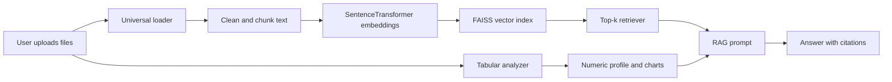

# Presentation Guide

## 1. Problem

Organizations store knowledge in mixed formats: PDFs, Word files, spreadsheets, CSV exports, and text notes. A normal chatbot cannot reliably answer from these files or explain numeric data clearly.

## 2. Solution

This project is an intelligent universal document RAG assistant. Users upload files, the backend chunks and indexes them, the retriever selects the most relevant top-k chunks, and the LLM answers with citations. For numeric files, the system also generates summary statistics and chart-ready analysis.

## 3. Architecture

## 4. Demo Flow

1. Start FastAPI and Streamlit.
2. Upload a PDF or DOCX and ask for a summary with sources.
3. Upload a CSV or Excel file and ask for trends, outliers, or comparisons.
4. Show the retrieved chunks, confidence score, and generated charts.
5. Run the evaluation script and explain precision@k, recall@k, MRR, and grounding proxy.

## 5. Key Technical Decisions

- FAISS is used for fast vector similarity search.
- `all-MiniLM-L6-v2` keeps embeddings lightweight enough for local demos.
- Top-k retrieval is exposed in the UI so users can tune context size.
- Numeric profiling is separate from text retrieval so spreadsheets are both searchable and analyzable.
- The app works without an LLM key by returning retrieved context, which makes demos more robust.

## 6. Interview Answers

**Why RAG instead of fine-tuning only?**
RAG keeps answers grounded in fresh uploaded documents. Fine-tuning changes model behavior, but it does not reliably inject new private facts.

**How do you reduce hallucination?**
The prompt prioritizes retrieved context, answers include citations, confidence depends on retrieval coverage, and evaluation checks grounding.

**How would you improve this in production?**
Add hybrid search, cross-encoder reranking, metadata filters, persistent session storage, authentication, async indexing, observability, and a managed vector database.

**How do you evaluate it?**
Use retrieval metrics like precision@k, recall@k, and MRR, plus answer-grounding checks and human review for final answer quality.

.venv\Scripts\activate
pip install -r requirements.txt.txt
uvicorn api.main:app --reload
streamlit run ui/app.py

.\run_app.ps1
http://127.0.0.1:8501 then open

